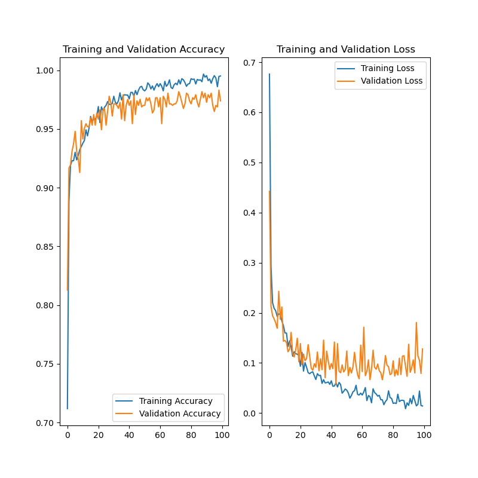

# face-mask-detection

#### 介绍
基于tensorflow的人脸口罩识别

#### 软件架构
软件架构说明
使用tensorflow实现人脸口罩识别

#### 安装教程
1. 安装python3, pip3
1. 安装库（pip3 install -r requirements.txt）
2. 安装cuda (可选)

#### 使用说明

1.  训练模型（python train_mask_model.py --dataset dataset）
2.  在图片上检测口罩（python face_mask_detect_image.py --image your_image.jpg）
3.  在视频/摄像头上检测口罩(python face_mask_detect_video.py --video your_video.mp4 / python face_mask_detect_video.py)
4.  详细参数查询 python train_mask_model.py -h / python face_mask_detect_image.py -h / python face_mask_detect_video.py -h

#### 参与贡献

1.  Fork 本仓库
2.  新建 Feat_xxx 分支
3.  提交代码
4.  新建 Pull Request
